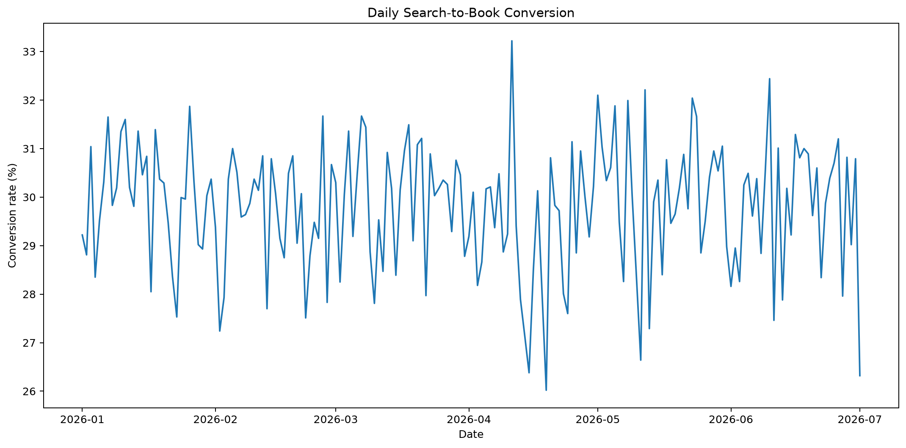
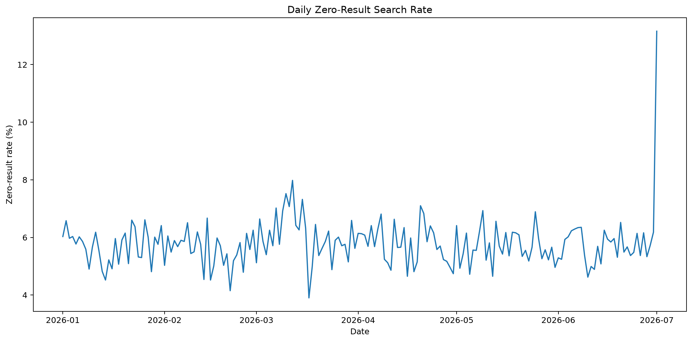
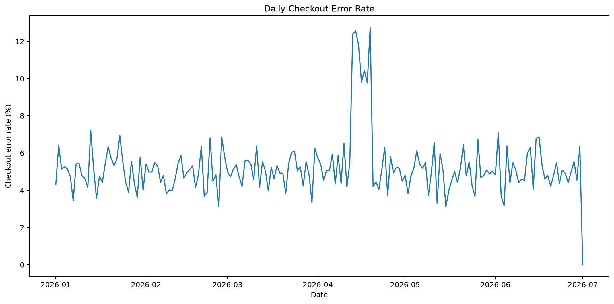
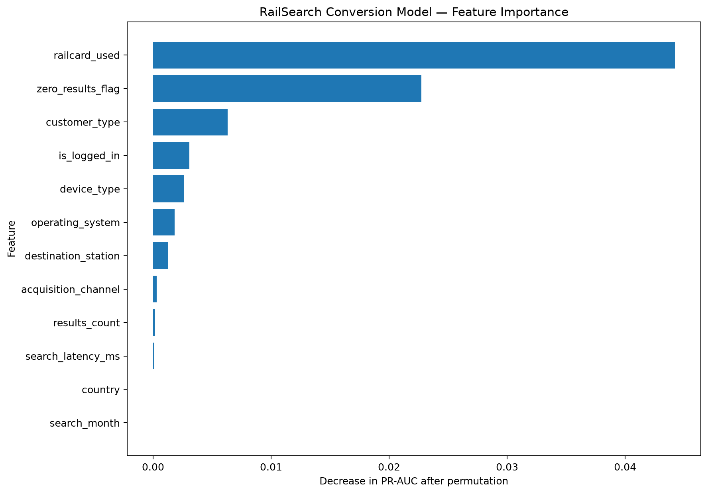
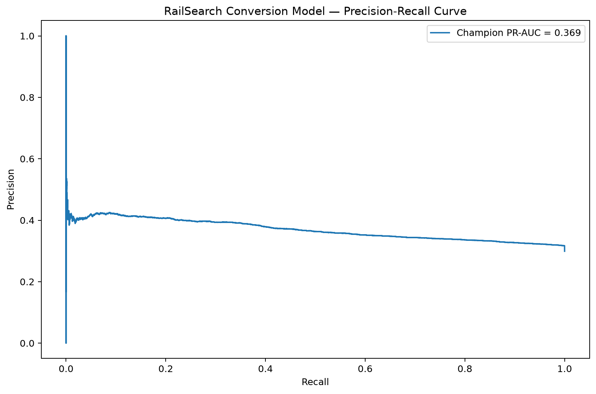

# RailSearch — Customer Journey & Conversion Intelligence

An end-to-end **Product Analytics, Data Science, Machine Learning and
MLOps** portfolio project modelling the digital rail-booking journey
from search through booking.

> **Important:** RailSearch uses synthetic customer-journey data created
> specifically for portfolio demonstration. It contains no proprietary
> Trainline data.

---

## Recruiter visual pack

These figures are generated from the synthetic RailSearch analytical workflow.

<p align="center">
  
</p>

| Zero-Result Monitoring | Checkout Error Monitoring |
| --- | --- |
|  |  |

| Model Feature Importance | Precision-Recall Curve |
| --- | --- |
|  |  |

---

## Business problem

RailSearch investigates realistic digital-travel questions:

- Why has conversion declined?
- Why are searches returning no journey results?
- Which routes or devices create customer friction?
- Where are checkout failures occurring?
- What is the potential commercial impact?
- Which searches are most likely to convert?
- Can recurring product issues be detected automatically?
- Can the resulting ML model be operationalised?

---

## Customer journey

```text
Search
  ↓
Journey Results
  ↓
Journey Selection
  ↓
Checkout
  ↓
Payment
  ↓
Booking
  ↓
Revenue
```

---

## Dataset scale

| Metric | Result |
|---|---:|
| Sessions | 150,000 |
| Searches | 260,724 |
| Zero-result searches | 14,993 |
| Checkout attempts | 121,427 |
| Checkout errors | 6,376 |
| Payment failures | 4,638 |
| Checkout abandonments | 32,654 |
| Bookings | 77,759 |
| Simulated revenue | £5,119,154.52 |
| Average order value | £65.83 |
| Search-to-book conversion | 29.82% |
| Session conversion | 43.64% |
| Zero-result rate | 5.75% |
| Anomaly-alert days | 9 |

---

## Product investigation

### Search / supply incident

Zero-result rate:

**5.83% →
20.21%**

Search-to-book conversion:

**30.28% →
24.20%**

Estimated simulated revenue impact:

**£5,066.14**

Statistical p-value:

**0.00000000**

### Mobile checkout incident

Checkout-error rate:

**5.69% →
20.66%**

Checkout-to-booking conversion:

**63.50% →
54.32%**

Estimated simulated revenue impact:

**£12,557.72**

Statistical p-value:

**0.00000000**

---

## Anomaly detection

Rolling historical baselines identify abnormal:

- conversion declines;
- zero-result spikes;
- checkout-error spikes.

Validated anomaly-alert days:

**9**

---

## Predictive modelling

### Objective

Predict whether a rail search will eventually result in a booking.

### Prediction point

**after search results and before journey selection**

### Candidate models

- Dummy Classifier
- Logistic Regression
- Histogram Gradient Boosting

### Champion model

**Logistic Regression**

---

## Temporal model validation

RailSearch deliberately avoids a random train/test split.

- **January–April 2026:** training
- **May 2026:** validation
- **June 2026:** locked test set

The champion model is selected using validation performance before the
locked test period is evaluated.

---

## Locked test performance

| Metric | Score |
|---|---:|
| ROC-AUC | 0.6011 |
| PR-AUC | 0.3687 |
| Log Loss | 0.5834 |
| Brier Score | 0.2017 |
| Accuracy @ 0.50 | 0.7010 |
| Precision @ 0.50 | 0.0000 |
| Recall @ 0.50 | 0.0000 |
| F1 @ 0.50 | 0.0000 |

---

## Ranking performance

Overall locked-test booking rate:

**29.90%**

Top predicted decile booking rate:

**41.43%**

Top-decile lift:

**1.386x**

---

## Model explainability

Permutation importance is calculated using held-out test observations.

Top features:

- `railcard_used` — 0.04421
- `zero_results_flag` — 0.02274
- `customer_type` — 0.00630
- `is_logged_in` — 0.00306
- `device_type` — 0.00262
- `operating_system` — 0.00181
- `destination_station` — 0.00129
- `acquisition_channel` — 0.00030
- `results_count` — 0.00018
- `search_latency_ms` — 0.00007

Full results:

`reports/tables/stage4_feature_importance.csv`

---

## Leakage controls

Variables occurring after the prediction point are deliberately excluded:

- journey selection;
- checkout start;
- checkout errors;
- payment failures;
- checkout completion;
- abandonment;
- booking revenue.

Search-result information remains valid because predictions occur after
the result set is returned.

---

## Analytical warehouse

The DuckDB warehouse contains:

- typed staging models;
- search funnel;
- KPI summary;
- daily funnel;
- device performance;
- acquisition-channel performance;
- route performance;
- zero-result analysis;
- checkout-failure analysis;
- commercial-impact analysis;
- anomaly monitoring.

Data-quality checks validate:

- unique sessions;
- unique searches;
- referential integrity;
- valid funnel ordering;
- zero-result consistency.

---

## Production API

The champion model is exposed through **FastAPI**.

### Endpoints

```text
GET  /health
GET  /model
POST /predict
POST /predict/batch
```

Capabilities include:

- strict Pydantic validation;
- single predictions;
- batch predictions;
- probability scoring;
- configurable prediction threshold;
- model metadata;
- health monitoring.

Run locally:

```bash
python -m uvicorn railsearch.api.main:app --host 127.0.0.1 --port 8000
```

Swagger UI:

```text
http://127.0.0.1:8000/docs
```

---

## Technology stack

### Data Science

- Python
- pandas
- NumPy
- scikit-learn
- SciPy
- statsmodels

### Data & Analytics

- SQL
- DuckDB
- Parquet

### Machine Learning

- Logistic Regression
- Histogram Gradient Boosting
- temporal validation
- calibration analysis
- threshold analysis
- permutation importance
- ranking and lift

### Production ML

- FastAPI
- Pydantic
- Uvicorn
- joblib

### Engineering

- pytest
- Ruff
- Docker
- Git
- GitHub
- GitHub Actions

---

## Project architecture

See:

[`docs/ARCHITECTURE.md`](docs/ARCHITECTURE.md)

---

## Project structure

```text
railsearch-customer-journey-intelligence/
│
├── .github/
│   └── workflows/
│
├── artifacts/
│   └── models/
│
├── config/
│
├── data/
│   ├── raw/
│   └── processed/
│
├── docs/
│
├── reports/
│   ├── figures/
│   └── tables/
│
├── scripts/
│
├── sql/
│   ├── staging/
│   ├── analytics/
│   └── product/
│
├── src/
│   └── railsearch/
│       └── api/
│
├── tests/
│
├── Dockerfile
├── pyproject.toml
├── requirements.txt
└── README.md
```

---

## Reproduce RailSearch

Generate the synthetic dataset:

```bash
python scripts/generate_synthetic_events.py
```

Build the analytical warehouse:

```bash
python scripts/build_stage2b_warehouse.py
```

Run the product investigation:

```bash
python scripts/run_stage3_investigation.py
```

Train the predictive model:

```bash
python scripts/run_stage4_modeling.py
```

Build and test the production API:

```bash
python scripts/setup_stage5_production.py
```

Run all tests:

```bash
python -m pytest -q
```

Run code-quality validation:

```bash
python -m ruff check src scripts tests
```

---

## Key competencies demonstrated

**Product Analytics → SQL → Statistical Investigation → Funnel Analysis →
Machine Learning → Explainability → Model Validation → MLOps →
Production API → Testing → CI/CD**

---

## Limitations

RailSearch is a portfolio simulation.

Customer behaviour, incidents, conversion rates, financial-impact values
and predictive performance are synthetic and should not be interpreted
as actual Trainline operating or commercial results.

---

## Author

**Oluwatosin Oluwaseun Mulero**

Data Analyst | Data Scientist

GitHub:

https://github.com/tosinmulero

Portfolio:

https://tosinmulero.github.io/data-analytics-portfolio/
