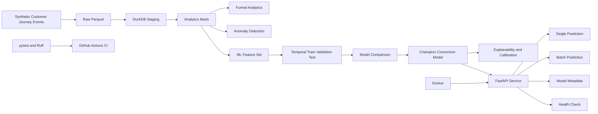

# RailSearch Architecture

## End-to-end architecture

## Analytical workflow

1. Generate reproducible synthetic customer-journey data.
2. Persist raw event tables as Parquet.
3. Build typed DuckDB staging models.
4. Create reusable product-analytics marts.
5. Analyse customer-funnel performance.
6. Detect abnormal conversion, zero-result and checkout behaviour.
7. Quantify statistical and simulated commercial impact.
8. Engineer leakage-safe predictive features.
9. Apply temporal train, validation and locked test periods.
10. Compare candidate machine-learning models.
11. Select and refit the champion model.
12. Evaluate calibration, ranking and explainability.
13. Persist the trained model artifact.
14. Serve predictions through FastAPI.
15. Validate software quality with pytest, Ruff, Docker and CI.

## Prediction boundary

RailSearch predicts whether a search will eventually result in a booking
immediately after journey results have been returned.

Downstream variables are excluded from modelling, including:

- journey selection;
- checkout start;
- checkout errors;
- payment failures;
- checkout completion;
- abandonment;
- booking revenue.

This prevents target leakage.

## Data disclaimer

RailSearch uses synthetic customer-journey data for portfolio
demonstration and contains no proprietary Trainline data.
